# Jev Ask

Ask a market question in plain English. Get a likelihood, a range, and the steps behind it.

Educational tool. Not financial advice.

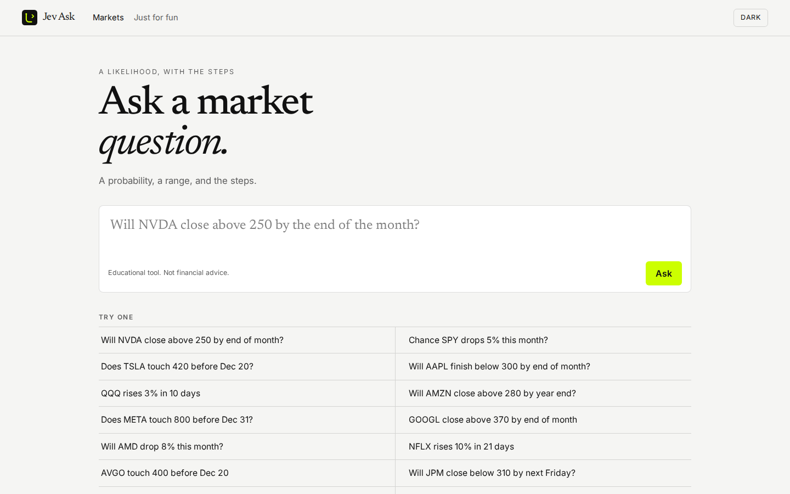

## What you can ask

Type a sentence such as "Will NVDA close above 250 by end of month?", "Chance SPY drops 5% this month?", or "Does TSLA touch 420 before Dec 20?".

The screen shows the parsed intent as chips you can edit. Changing a chip recomputes the answer. The big number is the likelihood. The range is the confidence band. A short paragraph and five numbered steps show the working. A chart draws the recent closes and the target.

Every answer says which parser ran, and whether the prices were live or cached. Recent questions stay in the browser and in the database. Light and dark mode follow the system until you choose, then the choice stays in localStorage.

The header also opens Just for fun, a separate page for silly questions. It is not the market tool.

## Just for fun

`/fun` is a playground for pop culture, memes, movies, music, sports banter, food, everyday life, space, and pets. It is linked from the header and from the home page, and it stays off the market parser.

Shuffle deals a card from a curated bank of 162 questions. Each card has a likelihood, a short base-rate style reason, a category, and a tag such as Base rate, Vibes, or Physics says no. The free-text box tries a fuzzy match against that bank first. If nothing is close, a local vibe engine hashes the wording so the same question always returns the same likelihood. The words ever, tomorrow, and cat nudge that number. Every fun answer includes the line "For fun. Not a prediction."

The bank lives in `data/fun/questions.json` and is seeded into SQLite or MySQL on startup. Fun asks are stored in their own history, separate from market questions. Copy link shares `/fun/{id}`. Download PNG saves the card.

If the `OLLAMA_URL` environment variable is set, a local Ollama model may rewrite the vibe engine's reason text. The likelihood stays the hashed number. If Ollama is unset, slow, or unusable, the templated reason is kept. The app does not call Ollama for fun questions unless that variable is set.

| Shuffle, light desktop | Shuffle, dark desktop |
| --- | --- |
| 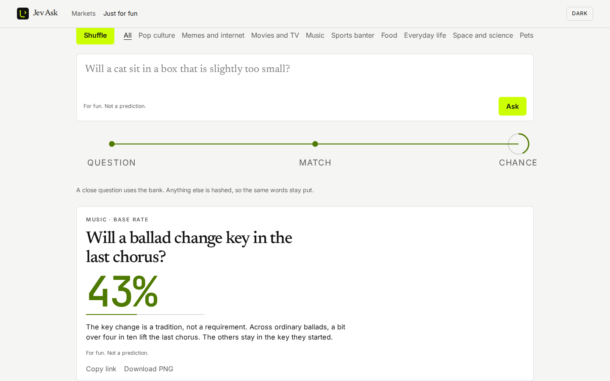 | 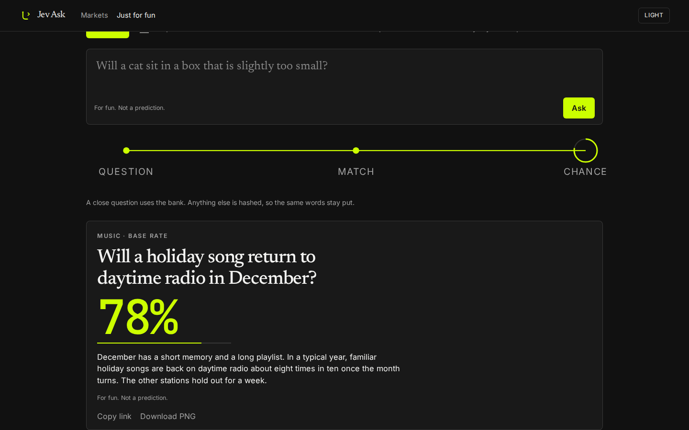 |
| Shuffle, light phone | Shuffle, dark phone |
| 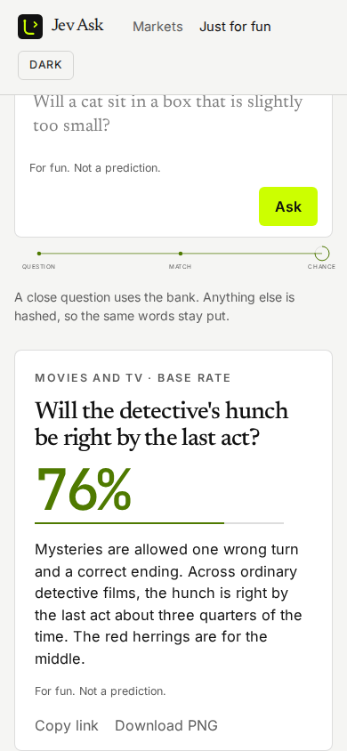 | 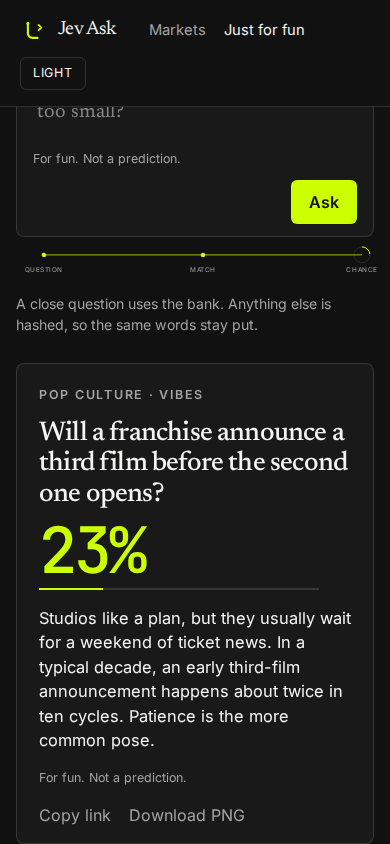 |

| Free text, light desktop | Free text, dark desktop |
| --- | --- |
| 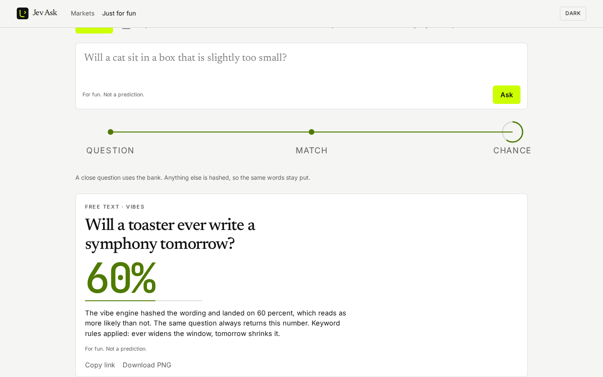 | 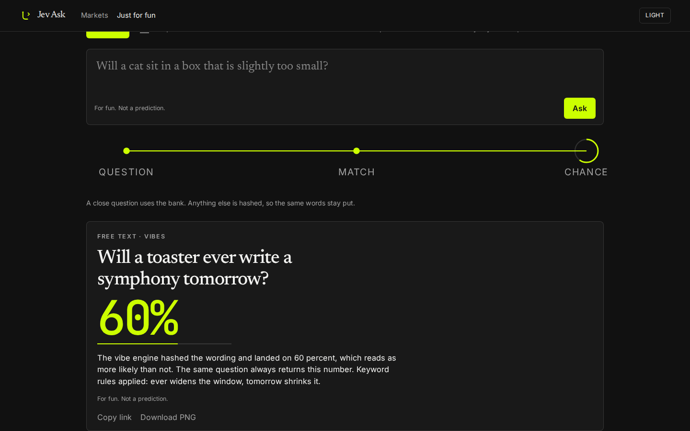 |
| Free text, light phone | Free text, dark phone |
| 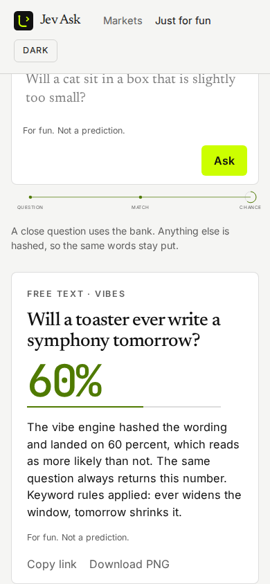 | 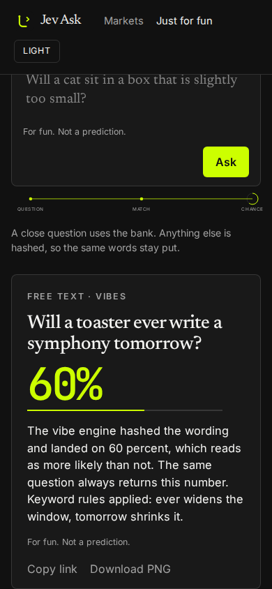 |

| Category, light desktop | Category, dark desktop |
| --- | --- |
| 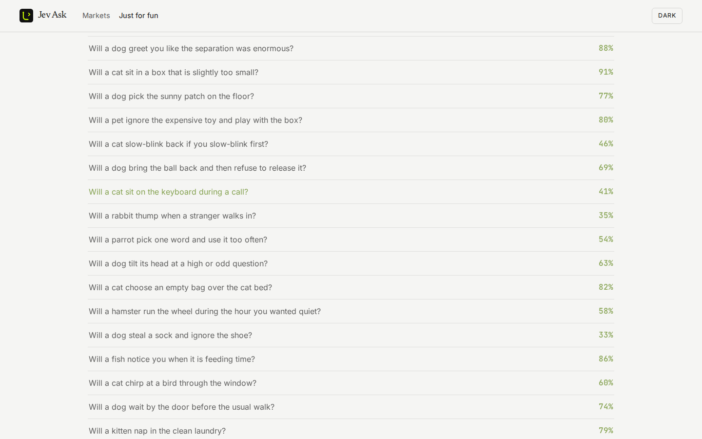 | 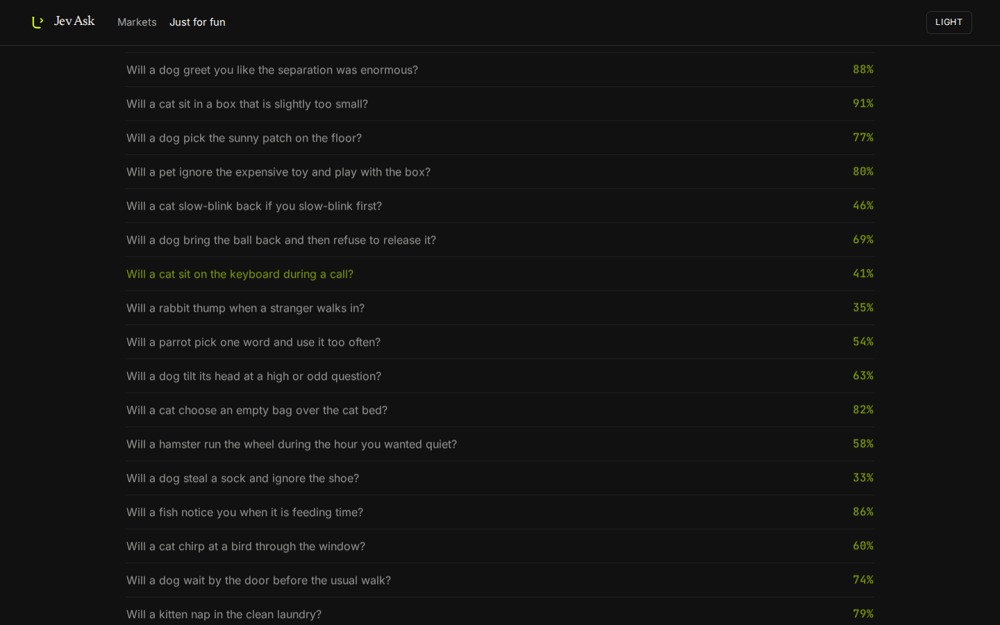 |
| Category, light phone | Category, dark phone |
| 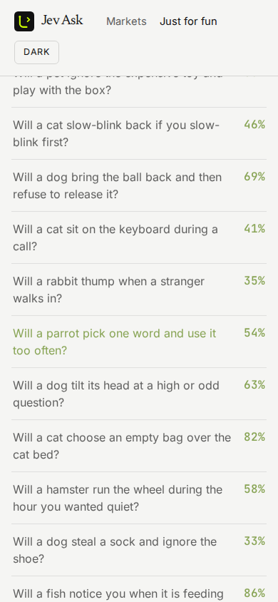 | 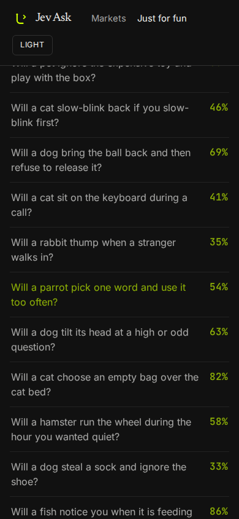 |

A PDF brief can be downloaded. QuestPDF is used under its Community license.

Educational tool. Not financial advice.

## Motion

Pages crossfade when the route changes. Sections fade and rise 12px over about a third of a second, with the children staggered. The likelihood counts up. The range bar, the fun meter, and the chance ring fill from zero when they scroll into view. The price chart draws its line, then the area underneath.

"How the number is made" is an SVG on the answer: spot, vol, days, then the chance. Just for fun has the same kind of diagram for question, match, and chance. Buttons lift slightly on hover. Switching light and dark fades the colors.

The answer page also has a path field. It lazy-loads three.js, caps the pixel ratio at 2, and pauses when it leaves the screen. Drag to orbit the lime surface and the sample paths. If motion is reduced, or WebGL cannot start, a still drawing is shown instead and nothing autoplays.

## Screenshot tour

Home, light and dark, desktop and phone.

| Light desktop | Dark desktop |
| --- | --- |
|  | 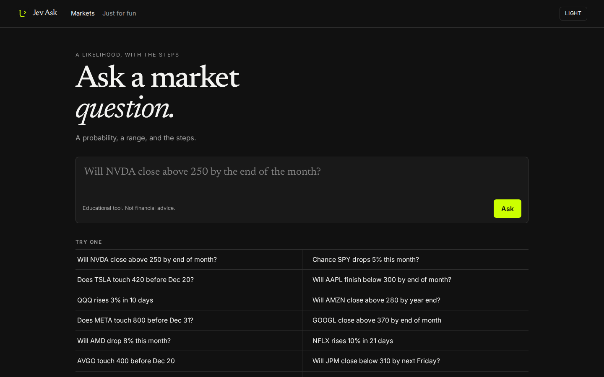 |
| Light phone | Dark phone |
| 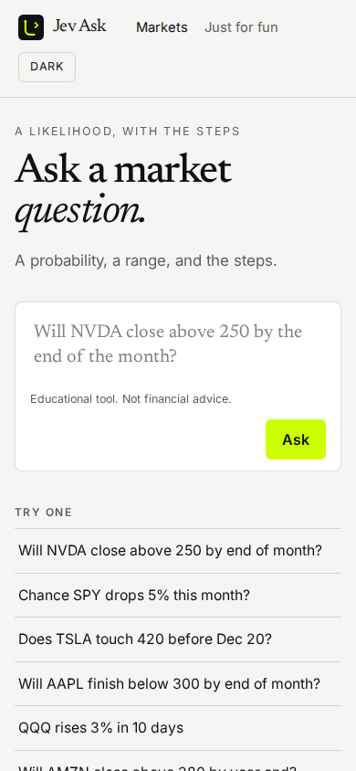 | 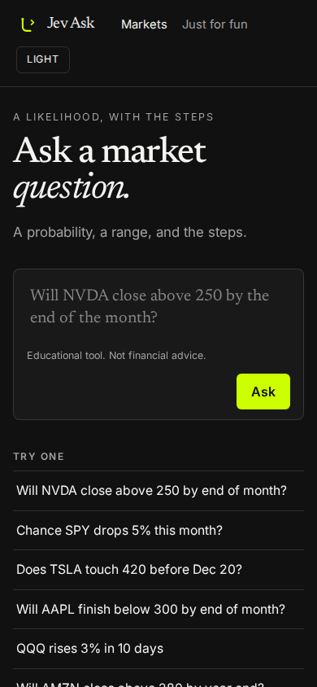 |

Answer card, same four views.

| Light desktop | Dark desktop |
| --- | --- |
| 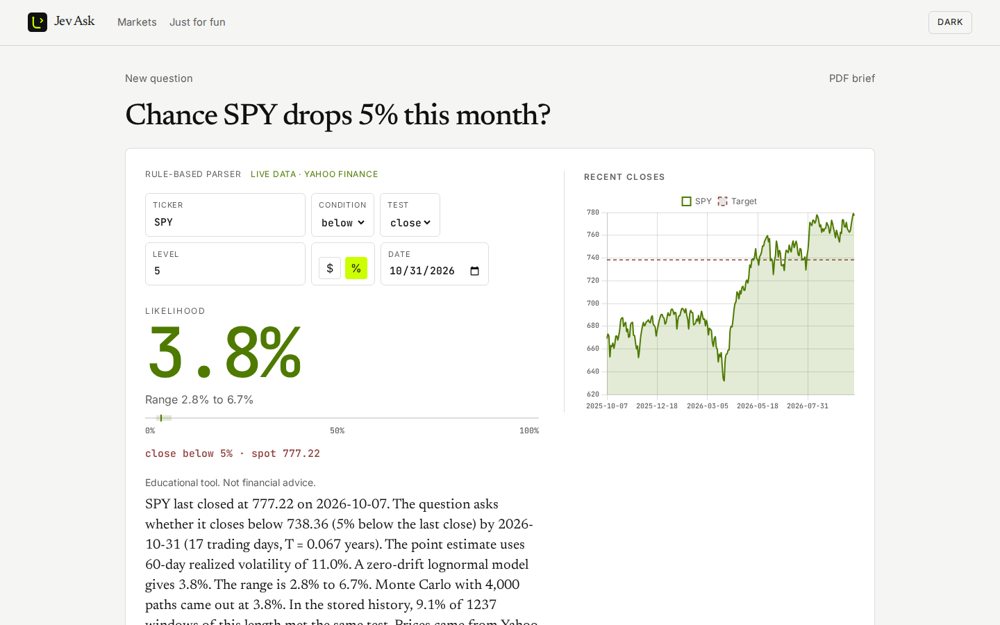 | 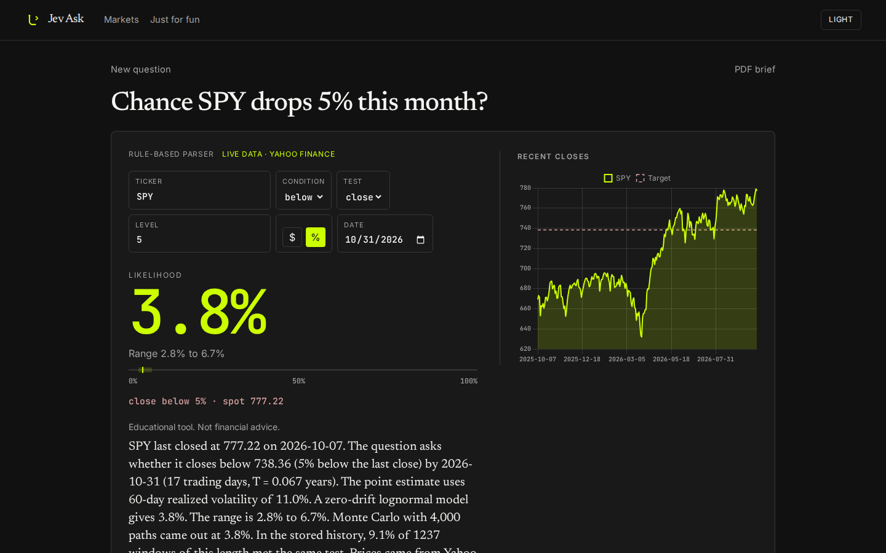 |
| Light phone | Dark phone |
| 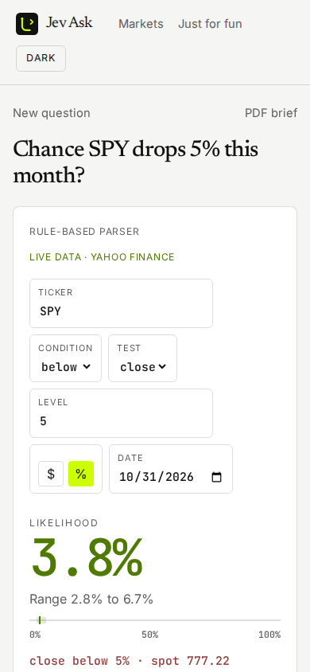 | 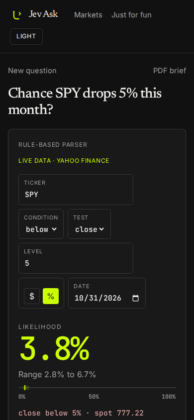 |

## Stack

- ASP.NET Core 8 Web API
- Angular 22, standalone components and signals, zoneless
- SQLite by default, or MySQL 5.7 through Pomelo EF Core
- Chart.js for the price chart
- three.js for the path field on an answer, loaded only when that view is on screen
- Newsreader, Inter, and JetBrains Mono
- QuestPDF Community for the PDF brief
- xUnit for the parser, the probability math, model fallback, samples, and the SQLite migration

## Architecture

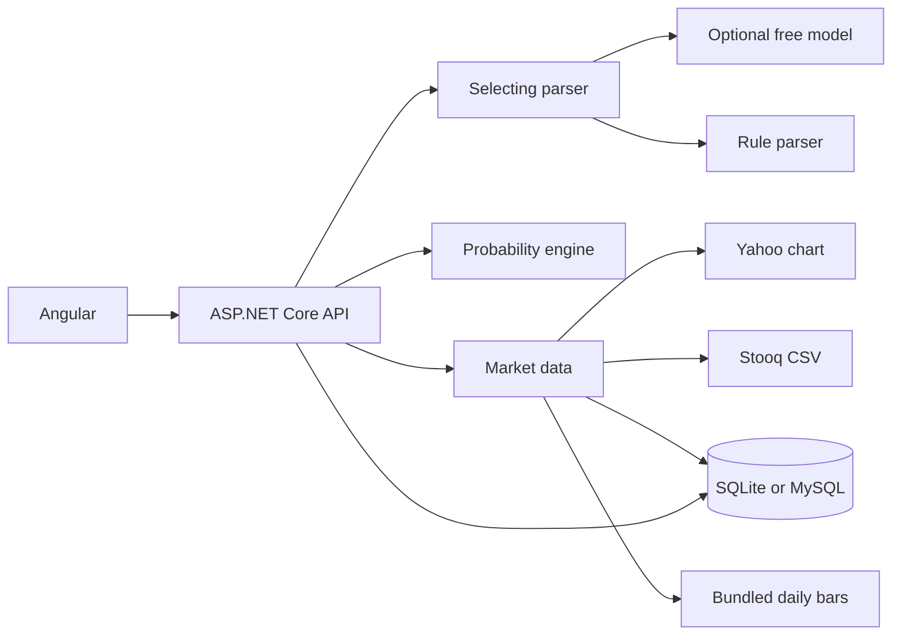

The browser talks only to the API. The parser turns a sentence into a ticker, a direction, a close or touch test, a price or a percent, and an expiry. The engine reads daily closes and returns a probability, a band, a Monte Carlo check, and an empirical frequency. Market data tries Yahoo, then Stooq, then a saved series, then a bundled file. Question history and cached bars live in the same database.

## Parser

The default parser is rule based and needs no key.

It finds a ticker in this order: a dollar ticker such as `$NVDA`, then a company or index name, then a bare uppercase symbol of two to five letters. Names include Apple, Nvidia, Tesla, Microsoft, Amazon, Google, Meta, Netflix, AMD, Broadcom, JPMorgan, Disney, S&P 500, Nasdaq 100, and Russell 2000. The bundled set is SPY, QQQ, IWM, AAPL, MSFT, NVDA, AMZN, GOOGL, META, TSLA, AMD, NFLX, AVGO, JPM, and DIS.

Direction words such as above, below, drop, rise, gain, and touch set the condition. "Touch" or "hit" selects a barrier test. Other wording selects a close test. A percent such as `5%` is preferred over a dollar level, then a bare number. If the question does not say above or below, a percent drop is below and a percent rise is above. An absolute level is above when it is at or over the last close, and below otherwise.

Dates are read from the earliest, longest match. "Friday" and "this Friday" mean the coming Friday, including today. "Next Friday" means the Friday of the following week. "End of month" is the last calendar day. "End of year" is 31 December. "Next week" is seven days out. "In 10 days" and an explicit date such as `2026-12-20`, `12/20/2026`, or `Dec 20` are accepted. A missing date becomes 30 days out and the answer says so. Weekends are skipped when counting trading days. Holidays are not.

An optional model must return one JSON object:

```json
{
  "ticker": "NVDA",
  "condition": "above",
  "style": "close",
  "levelMode": "absolute",
  "level": 250,
  "expiry": "2026-10-31"
}
```

`condition` is `above`, `below`, or `auto`. `style` is `close` or `touch`. `levelMode` is `absolute` or `percent`. `level` must be greater than zero. `expiry` is `yyyy-MM-dd`. Anything else, including a transport error, falls back to the rule parser. The answer says when that happens.

## Probability

The model assumes zero price drift. The log drift is `v = -sigma^2 / 2`. Time is trading days divided by 252. Spot is the last close on or before the as-of date.

Realized volatility is the sample standard deviation of log returns, annualized with `sqrt(252)`, on 20, 60, and 252 trading days. The point estimate uses the 60-day window when it exists.

A close probability is the lognormal terminal chance:

`Phi((ln(S / K) + v T) / (sigma sqrt(T)))`

for a close above `K`. A close below uses the complement.

A touch probability is the continuous first-passage formula for the same drift, with a Broadie-Glasserman-Kou shift so the barrier matches daily monitoring. The barrier is multiplied by `exp(0.5826 * sigma / sqrt(252))` for an upper level, and divided by that factor for a lower level. A daily Monte Carlo otherwise sits below the continuous formula, because daily closes miss moves between closes.

The Monte Carlo cross-check uses the same drift, one step per trading day, Box-Muller normals, and a fixed seed. The empirical frequency counts past windows of the same length. Absolute levels skip windows that already satisfy the barrier. The empirical number is omitted when fewer than 30 windows qualify.

The band is the min and max close or touch probability across the vol windows that exist. With a single window, a bootstrap of that window supplies a 10th to 90th percentile band. The band is widened so it always contains the point estimate. Zero volatility or zero time is deterministic.

## Free model setup

Leave `PARSER_PROVIDER` unset or set it to `rule`. That is the default, and it needs no key.

Ollama, local and free:

```bash
export PARSER_PROVIDER=ollama
export OLLAMA_URL=http://localhost:11434
export OLLAMA_MODEL=llama3.1
```

OpenRouter free tier. The default model id ends in `:free`. Put the key only in the environment.

```bash
export PARSER_PROVIDER=openrouter
export OPENROUTER_API_KEY=your-key
export OPENROUTER_MODEL=meta-llama/llama-3.1-8b-instruct:free
```

Groq free tier:

```bash
export PARSER_PROVIDER=groq
export GROQ_API_KEY=your-key
export GROQ_MODEL=llama-3.1-8b-instant
```

Gemini free tier:

```bash
export PARSER_PROVIDER=gemini
export GEMINI_API_KEY=your-key
export GEMINI_MODEL=gemini-2.0-flash
```

Copy `.env.example` for the full list. Do not commit a filled `.env`. Empty placeholders also live in `src/JevAsk.Api/appsettings.Development.example.json`. The committed `appsettings.json` and `appsettings.Development.json` contain no keys.

## API

| Method | Path | Body | Result |
| --- | --- | --- | --- |
| GET | `/api/health` |  | status, parser name, database provider |
| GET | `/api/examples` |  | example questions |
| GET | `/api/tape` |  | last close and change for the tape symbols |
| GET | `/api/history` |  | latest saved questions |
| GET | `/api/history/{id}` |  | one saved answer |
| POST | `/api/ask` | `{ "question": "...", "asOf": "2026-10-08" }` | answer, stored in history |
| POST | `/api/recompute` | ticker, condition, style, levelMode, level, expiry, optional asOf | answer after a chip edit |
| POST | `/api/brief.pdf` | the answer JSON | `application/pdf` |
| GET | `/api/fun/bank` | optional `category` | curated fun questions |
| GET | `/api/fun/history` |  | latest fun asks |
| GET | `/api/fun/asks/{id}` |  | one saved fun answer |
| POST | `/api/fun/ask` | `{ "question": "..." }` | bank match or vibe answer, stored |
| POST | `/api/fun/shuffle` |  | a random bank card, stored |

History rows and saved answers include `url` when `PUBLIC_BASE_URL` is set. The UI calls these routes as `api/...` under its base href.

`asOf` is optional and defaults to today's UTC date. Enums on the wire are camel case: `above`, `below`, `close`, `touch`, `absolute`, `percent`.

## Run on your machine

Zero config uses SQLite. No database server and no API key.

```bash
export PATH="$HOME/.dotnet:$PATH"
dotnet run --project src/JevAsk.Api
```

The API listens on `http://localhost:5080`.

```bash
cd web
npm ci
npx ng serve
```

The UI listens on `http://localhost:4200` and proxies `/api` to port 5080.

Angular 22 needs Node `22.22.3` or newer. The API needs the .NET 8 SDK.

## Deploy under MAMP

MAMP Apache serves the built UI at `http://localhost:8888/grokbot/asp/jev-ask/`. MAMP MySQL 5.7.39 listens on `127.0.0.1` port `8889`. The API keeps its own routes (`/api/...`) and Apache proxies the sub-path onto them. `dotnet run` with no database variables still uses SQLite.

Build the UI for that folder. The base href has to end with a slash.

```bash
cd web
npm ci
npx ng build --base-href /grokbot/asp/jev-ask/
```

Copy `web/dist/web/browser/` into the Apache document root at `grokbot/asp/jev-ask/` (often `/Applications/MAMP/htdocs/grokbot/asp/jev-ask`).

Create a database named `jevask`. The example login is user `root` and password `root`. Those values are placeholders for a local MAMP install. They appear only in `.env.example` and `appsettings.Development.example.json`.

```bash
export DATABASE_PROVIDER=mysql
export MYSQL_CONNECTION="Server=127.0.0.1;Port=8889;Database=jevask;User=root;Password=root;CharSet=utf8mb4;SslMode=None;"
export PUBLIC_BASE_URL=http://localhost:8888/grokbot/asp/jev-ask
dotnet run --project src/JevAsk.Api
```

Leave `MYSQL_SERVER_VERSION` unset. Pomelo then calls `ServerVersion.AutoDetect` against that connection. Set `MYSQL_SERVER_VERSION=5.7.39-mysql` only when you want to pin the version without a detection query. The schema uses `utf8mb4` / `utf8mb4_unicode_ci`, `longtext`, and `datetime(6)`. It does not use MySQL 8 collations.

On startup the API applies EF Core migrations and, if the series table is empty, seeds the bundled daily bars. Missing fun-bank rows are seeded from `data/fun/questions.json` on every startup. Question history, fun asks, and cached bars all live in MySQL. A later live fetch replaces a seeded row. Rows that are still the bundled file are labeled `bundled sample`. Other saved rows are labeled `saved cache`.

When `PUBLIC_BASE_URL` is set, saved answers and history rows include a `url` such as `http://localhost:8888/grokbot/asp/jev-ask/q/4`. The PDF prints that link. An empty base leaves `url` null, which is the zero-config default.

Apache must proxy `/grokbot/asp/jev-ask/api/` to `http://127.0.0.1:5080/api/` and send other app paths to `index.html` so a refresh on `/q/4` still loads the UI. Enable `proxy` and `proxy_http`, then add this to the MAMP Apache config:

```apache
ProxyPreserveHost On
ProxyPass /grokbot/asp/jev-ask/api/ http://127.0.0.1:5080/api/
ProxyPassReverse /grokbot/asp/jev-ask/api/ http://127.0.0.1:5080/api/

<Directory "/Applications/MAMP/htdocs/grokbot/asp/jev-ask">
    Require all granted
    Options -Indexes
    FallbackResource /grokbot/asp/jev-ask/index.html
</Directory>
```

The browser calls `api/...` relative to the base href, including `api/brief.pdf`. A route such as `/q/4` still requests `http://localhost:8888/grokbot/asp/jev-ask/api/...`, not `/api/...` at the host root.

## Docker Compose

Docker Compose starts MySQL 5.7, the API, and the web UI at the site root. The MySQL root password in the compose file is `jevask`. That is a disposable local example so `docker compose up` needs no extra secrets. Do not reuse it anywhere else.

```bash
docker compose up --build
```

- UI: `http://localhost:8088`
- API: `http://localhost:8080`
- MySQL 5.7: `127.0.0.1:3306`, database `jevask`, user `root`, password `jevask`

The API waits until MySQL is healthy, then migrates and seeds.

## Tests

```bash
dotnet test
```

The suite covers more than 25 parser questions, the normal CDF, close and touch formulas, the Monte Carlo cross-check, trading-day counts, the ask service, LLM fallback, the PDF header, all 15 bundled tickers, a SQLite migration that stores a question, the fun vibe engine, and the fun question matcher.

GitHub Actions builds the API, runs the tests, and builds the Angular app. See `.github/workflows/ci.yml`.

## Environment variables

| Variable | Purpose | Default |
| --- | --- | --- |
| `PARSER_PROVIDER` | `rule`, `ollama`, `openrouter`, `groq`, or `gemini` | `rule` |
| `OLLAMA_URL` | Ollama base URL. The market parser uses localhost when its provider is ollama and this is empty. Just for fun calls Ollama only when this variable is set | empty for fun, localhost for the market parser |
| `OLLAMA_MODEL` | Ollama model | `llama3.1` |
| `OPENROUTER_API_KEY` | OpenRouter key | empty |
| `OPENROUTER_MODEL` | OpenRouter model | `meta-llama/llama-3.1-8b-instruct:free` |
| `GROQ_API_KEY` | Groq key | empty |
| `GROQ_MODEL` | Groq model | `llama-3.1-8b-instant` |
| `GEMINI_API_KEY` | Gemini key | empty |
| `GEMINI_MODEL` | Gemini model | `gemini-2.0-flash` |
| `DATABASE_PROVIDER` | `sqlite` or `mysql` | `sqlite` |
| `MYSQL_CONNECTION` | MySQL connection string, required when the provider is mysql | empty |
| `MYSQL_SERVER_VERSION` | Pomelo server version such as `5.7.39-mysql`. Empty uses auto-detect | empty |
| `PUBLIC_BASE_URL` | Public origin and path used for server-generated links | empty |

Config keys with the same meaning: `Parser:Provider`, `Database:Provider`, `Database:ServerVersion`, `PublicBaseUrl`, `ConnectionStrings:Cache`, `ConnectionStrings:MySql`, `MonteCarlo:Paths`, `MonteCarlo:Seed`, `Data:SamplePath`.

## Disclaimer

Educational tool. Not financial advice. The likelihood is a model of realized volatility, not a forecast and not a recommendation.

## License

MIT. See `LICENSE`.
